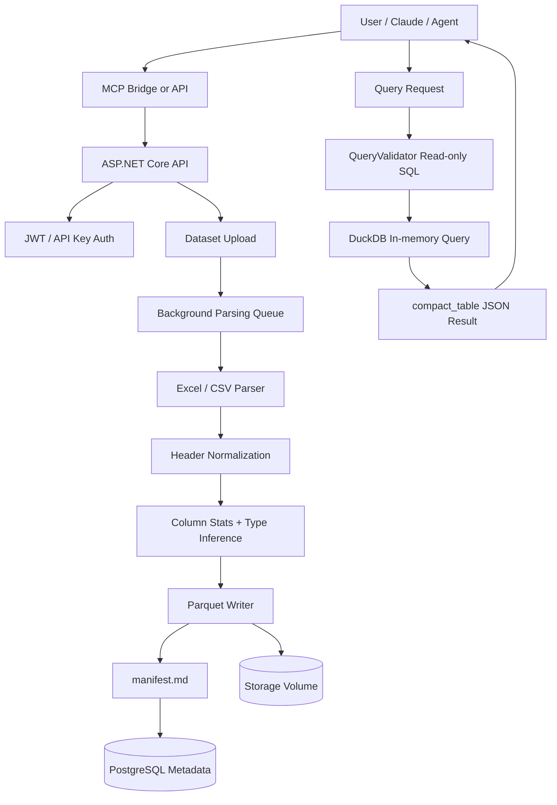
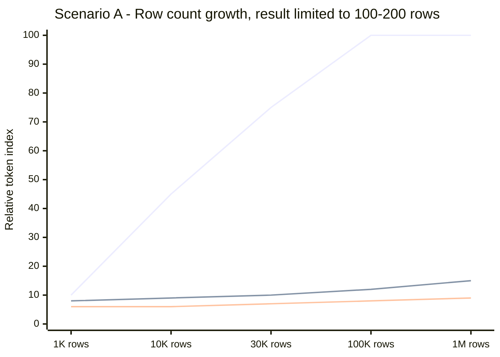
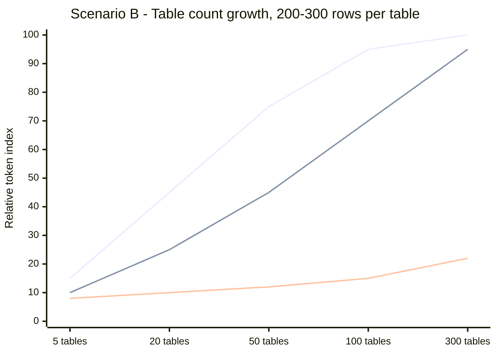
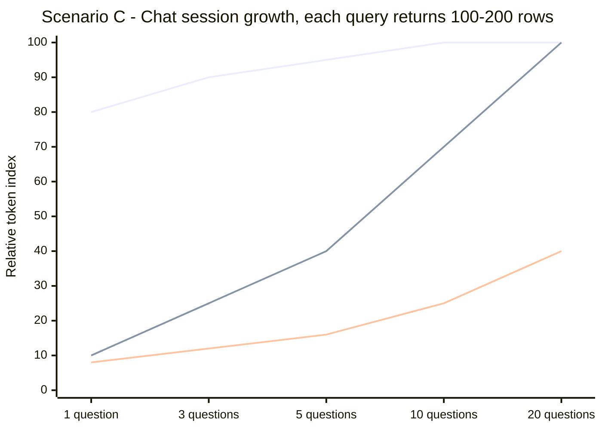
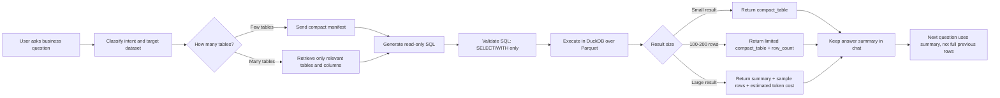
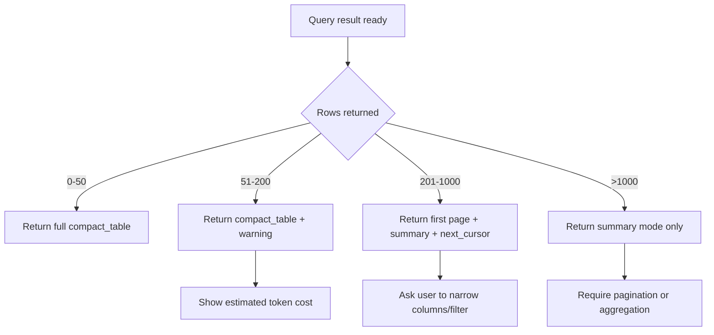
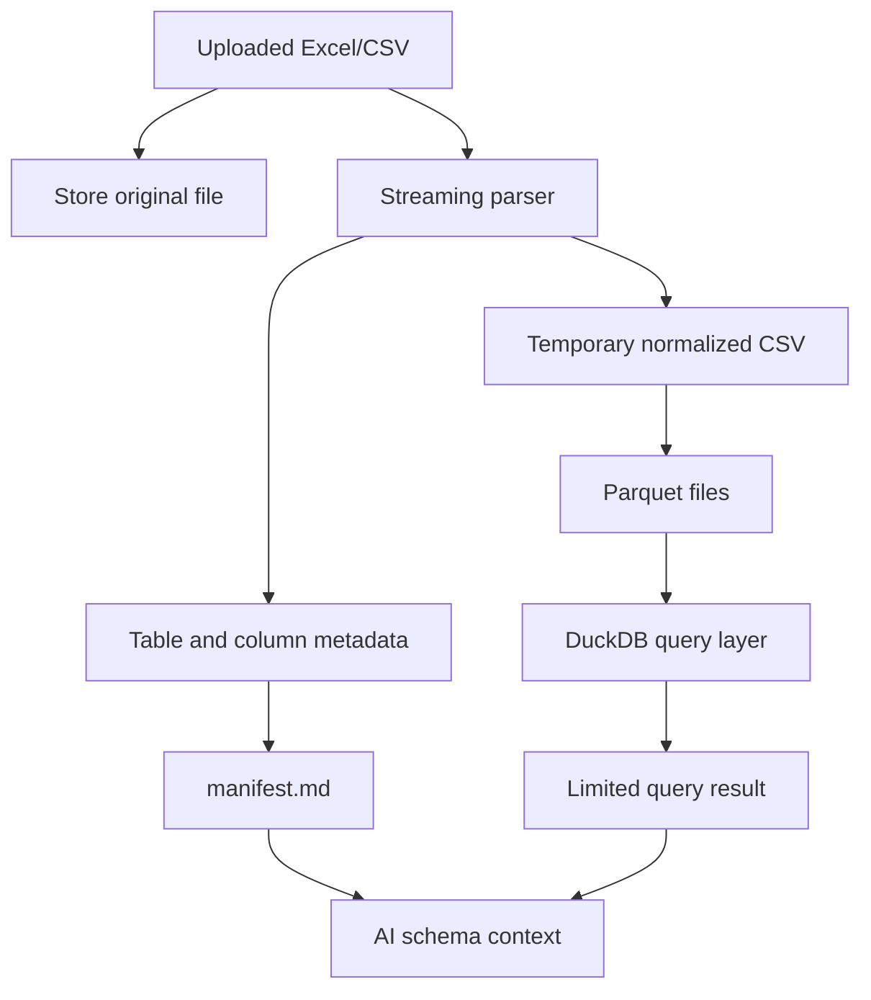

# Excel Dataset Manager

**Token-controlled spreadsheet analytics for AI agents.**

Excel Dataset Manager (EDM) is a self-hosted platform that turns Excel/CSV files into queryable datasets for AI agents. Instead of pushing an entire spreadsheet into a chat context, EDM stores the raw file on your server, parses it into metadata + Parquet, and lets the agent ask focused SQL questions through MCP/API.

> **Core positioning**
>
> EDM is not a zero-token data reader. EDM is a **token-controlled query layer** for AI.
>
> Token usage does not disappear. It shifts from “read the entire raw file” to “read only the relevant schema, SQL, and query result.”

---

## Why EDM?

Most AI + spreadsheet workflows require one of these approaches:

1. Upload the entire file directly into a chat.
2. Paste raw rows into the prompt.
3. Ask the model to infer everything from a large context window.
4. Build custom glue code for every dataset.

That works for small files, but becomes expensive and unstable when:

- row count grows;
- table count grows;
- questions become more complex;
- the chat session contains many previous query results;
- the answer only needs 100–200 rows but the model still receives the entire file.

EDM takes a different approach:

- **Raw data stays outside the model context.**
- **Files are parsed once, then queried many times.**
- **DuckDB reads Parquet locally.**
- **The AI receives only schema/manifest, SQL, and compact query results.**
- **Result size is controlled by `max_rows`, hard caps, pagination, and summary policies.**

---

## Current implementation summary



### Main source areas

| Area | Source path |
|---|---|
| API | `api/` |
| Dataset upload/list/detail | `api/Services/DatasetService.cs` |
| Background parsing | `api/BackgroundJobs/ParsingHostedService.cs` |
| File parsing | `api/Services/FileParserService.cs` |
| Header normalization | `api/Services/HeaderNormalizer.cs` |
| Manifest generation | `api/Services/ManifestGenerator.cs` |
| Parquet conversion | `api/Services/ParquetWriter.cs` |
| SQL validation | `api/Services/QueryValidator.cs` |
| Query execution | `api/Services/DuckDbQueryService.cs` |
| MCP bridge | `mcp-bridge/` |
| Deployment | `docker-compose.yml`, `Caddyfile`, `scripts/deploy.sh` |

---

## Token efficiency model

EDM should be evaluated with this formula:

```text
Direct upload token
≈ raw_file_tokens × number_of_questions_or_context_reloads
```

```text
EDM token per question
≈ relevant_schema_tokens
 + business_question_tokens
 + generated_sql_tokens
 + query_result_tokens
 + retained_chat_history_tokens
```

The most important point:

> EDM does not make token usage constant. EDM makes token usage depend on the **data actually needed for the answer**, instead of the **entire file size**.

---

## What consumes tokens?

| Component | Direct upload workflow | EDM workflow |
|---|---:|---:|
| Raw file rows | Very high | Usually not sent to model |
| Full schema | Often hidden inside raw file | Sent as manifest/schema, should be filtered |
| User question | Yes | Yes |
| SQL / reasoning | Sometimes implicit | Yes |
| Query result | Yes | Yes |
| Previous chat results | Yes | Yes |
| Session history | Yes | Yes |

The system is efficient only when it controls:

- how much schema is sent;
- how many rows are returned;
- how many columns are returned;
- how much previous result data is kept in the chat context.

---

# Benchmark scenarios

The following benchmark numbers are **simulation estimates**, not lab measurements.

They are designed to explain token behavior and product direction. Real token usage depends on:

- model tokenizer;
- average cell length;
- number of columns;
- SQL complexity;
- response format;
- whether previous results are kept or summarized;
- whether the AI receives full manifest or only relevant schema.

All charts use a **relative token index** from `0` to `100`, where:

- `100` means very high token pressure;
- lower is better;
- the values show direction and risk, not exact token counts.

---

## Scenario A — Few tables, row count grows

### Test shape

| Variable | Assumption |
|---|---:|
| Number of tables | 1–2 |
| Average columns | 15–25 |
| Row count | Increasing |
| Question complexity | Medium to high |
| Query result size | 100–200 rows |
| Main risk | Raw file grows very large |

### Expected behavior

When the number of rows grows but the query still returns only 100–200 rows, EDM is strongest.

The direct upload approach becomes expensive because the model must read a larger raw file. EDM stays controlled because the model receives only schema + SQL + limited result.



### Fallback table

| Dataset size | Raw upload | EDM query result 100–200 rows | EDM + summary |
|---:|---:|---:|---:|
| 1K rows | 10 | 8 | 6 |
| 10K rows | 45 | 9 | 6 |
| 30K rows | 75 | 10 | 7 |
| 100K rows | 100 | 12 | 8 |
| 1M rows | 100 | 15 | 9 |

### README claim

Good claim:

> When row count grows but the result set is limited, EDM prevents token usage from growing with the full raw file.

Bad claim:

> EDM token usage is fixed even when data grows.

---

## Scenario B — Many tables, small data per table

### Test shape

| Variable | Assumption |
|---|---:|
| Rows per table | 200–300 |
| Number of tables | Increasing |
| Question complexity | Medium to high |
| Query result size | 100–200 rows |
| Main risk | Schema/manifest becomes large |

### Expected behavior

This case is different from Scenario A.

Even if each table has few rows, a dataset with 200–300 tables can still be expensive if the agent receives the full manifest every time.

In this case, the main token risk shifts from **row data** to **schema size**.



### Fallback table

| Number of tables | Raw upload | EDM full manifest | EDM relevant schema only |
|---:|---:|---:|---:|
| 5 | 15 | 10 | 8 |
| 20 | 45 | 25 | 10 |
| 50 | 75 | 45 | 12 |
| 100 | 95 | 70 | 15 |
| 300 | 100 | 95 | 22 |

### README claim

Good claim:

> For many-table datasets, EDM must retrieve only relevant tables and columns before asking the model to generate SQL.

Bad claim:

> EDM always stays cheap when tables increase.

### Recommended improvement

For this scenario, EDM should add a **schema retrieval step**:

```text
User question
→ identify likely dataset/table names
→ retrieve only relevant table schemas
→ generate SQL
→ execute query
→ return compact result
```

---

## Scenario C — Medium dataset, questions in one chat session grow

### Test shape

| Variable | Assumption |
|---|---:|
| Number of tables | 5–10 |
| Total rows | 20K–30K |
| Question complexity | Medium to high |
| Query result size | 100–200 rows per question |
| Main risk | Previous query results accumulate in chat history |

### Expected behavior

EDM still saves token compared with direct raw upload. However, token usage grows if every query result is kept in the chat history.

For long sessions, EDM should summarize previous results and avoid keeping every 100–200-row response in full.



### Fallback table

| Questions in session | Raw upload in context | EDM keeping full results | EDM with result summaries |
|---:|---:|---:|---:|
| 1 | 80 | 10 | 8 |
| 3 | 90 | 25 | 12 |
| 5 | 95 | 40 | 16 |
| 10 | 100 | 70 | 25 |
| 20 | 100 | 100 | 40 |

### README claim

Good claim:

> In long chat sessions, EDM should summarize previous query results. Otherwise, token usage still grows with the number of returned rows kept in context.

Bad claim:

> Once the data is inside EDM, every follow-up question is always cheap.

---

# Optimized token-control design

This is the recommended operating model for EDM.

It combines all three scenarios:

1. Do not send raw files to the model.
2. Do not send full manifest when table count is large.
3. Do not keep full query results forever in the chat context.
4. Always cap result rows.
5. Use summary mode for large or repeated results.



## Optimized policy matrix

| Risk | Control policy |
|---|---|
| Row count grows | Keep raw data in Parquet; query only needed rows |
| Table count grows | Retrieve relevant schema only |
| Query returns too many rows | Enforce `max_rows`, hard cap, pagination |
| Result has many columns | Ask model to select needed columns only |
| Session has many questions | Summarize old results |
| User asks broad exploratory question | Return profile/summary first, not full rows |
| SQL is too complex | Validate query, expose executed SQL, log query |
| Column mismatch | Suggest closest columns |

---

## Recommended token modes

EDM should support these response modes:

| Mode | Use case | Response |
|---|---|---|
| `compact_table` | Normal query result | Columns + rows, capped by `max_rows` |
| `summary` | Large result or broad question | Row count, column count, sample rows, key stats |
| `profile` | Initial dataset exploration | Schema, table list, column stats |
| `schema_only` | SQL generation planning | Relevant table and column metadata |
| `paged_result` | User explicitly wants rows | Page cursor + limited rows |
| `explain_query` | Debugging | Submitted SQL + executed SQL + validation notes |

---

## Proposed response decision rule



---

## Example user flow

```text
User: Tổng hợp doanh thu theo tháng và chỉ ra tháng bất thường.

EDM flow:
1. Send relevant schema only.
2. Generate SQL:
   SELECT month, SUM(revenue) AS revenue
   FROM orders
   GROUP BY month
   ORDER BY month;
3. Execute in DuckDB.
4. Return 12 rows.
5. Model analyzes only 12 rows, not the full file.
```

Better than:

```text
Upload entire Excel file
→ model reads all rows
→ model tries to reason over raw cells
→ repeated questions keep reusing heavy context
```

---

## Query safety

Every SQL query should be read-only and controlled.

Current design principles:

- Accept only `SELECT` / `WITH`.
- Reject write operations such as `INSERT`, `UPDATE`, `DELETE`, `DROP`, `ALTER`, `CREATE`.
- Apply row limits.
- Run query in DuckDB over Parquet.
- Return structured JSON response.
- Log submitted SQL, executed SQL, elapsed time, row count, and error code.

---

## Storage model



---

## Data pipeline

1. **Upload**
   - Validate extension and file size.
   - Create dataset record.
   - Save original file.
   - Enqueue parsing job.

2. **Parse**
   - Read Excel/CSV.
   - Normalize headers.
   - Infer types.
   - Collect sample values and column stats.

3. **Store**
   - Convert normalized data to Parquet.
   - Save metadata in PostgreSQL.
   - Generate `manifest.md`.

4. **Query**
   - Validate SQL.
   - Create DuckDB views over Parquet.
   - Execute read-only query.
   - Return compact result.

5. **AI analysis**
   - AI reads only schema + result.
   - AI does not need the raw file unless explicitly requested.

---

## Token benchmark interpretation

### What EDM is good at

| Case | EDM fit |
|---|---|
| Large row count, small answer | Excellent |
| Aggregation questions | Excellent |
| Top-N reports | Excellent |
| Repeated analytical questions | Good if summaries are used |
| Many tables | Good only with relevant schema retrieval |
| Full data export | Not a token-saving use case |

### What EDM is not good at

| Case | Reason |
|---|---|
| Returning all rows to the model | Result tokens become large |
| Sending full schema for 300 tables every time | Schema tokens become large |
| Keeping every result in chat history | Session tokens grow |
| Asking vague questions without narrowing | Model may need too much schema/data |

---

## Recommended README claim

Use this:

> EDM reduces AI token usage by keeping raw spreadsheet data outside the model context and exposing a controlled SQL query layer. Token usage mainly depends on relevant schema, question complexity, generated SQL, and the size of the query result. For aggregate or limited-result questions, EDM avoids token growth from the full dataset size.

Avoid this:

> EDM makes large data analysis almost free in tokens.

---

## Quick start

```bash
git clone https://github.com/yourname/excel-dataset-manager
cd excel-dataset-manager

cp .env.example .env
# Edit .env: set POSTGRES_PASSWORD, JWT_KEY, EDM_DOMAIN, and other deployment values.

docker compose up -d --build
```

Default services:

| Service | Purpose |
|---|---|
| PostgreSQL | Metadata, users, API keys, query logs |
| EDM API | Upload, parse, query, auth |
| MCP bridge | Connect Claude/agents to EDM |
| Caddy | HTTPS reverse proxy |

---

## Example API query

```http
POST /api/datasets/{dataset_id}/query
Content-Type: application/json
Authorization: Bearer <token>
```

```json
{
  "queryType": "sql",
  "sql": "SELECT month, SUM(revenue) AS revenue FROM orders GROUP BY month ORDER BY month",
  "options": {
    "maxRows": 200,
    "returnFormat": "compact_table"
  }
}
```

Expected response shape:

```json
{
  "success": true,
  "status": "completed",
  "result": {
    "format": "compact_table",
    "columns": [
      { "name": "month", "type": "VARCHAR" },
      { "name": "revenue", "type": "DOUBLE" }
    ],
    "rows": [
      ["2026-01", 120000000],
      ["2026-02", 132000000]
    ],
    "row_count": 2,
    "truncated": false
  },
  "execution": {
    "engine": "duckdb",
    "max_rows": 200
  }
}
```

---

## Roadmap for stronger token efficiency

| Priority | Improvement | Why |
|---:|---|---|
| P0 | Enforce output token budget | Prevent large responses from flooding the model |
| P0 | Summary mode for large query results | Keep long sessions light |
| P1 | Relevant schema retrieval | Required for 100–300 table datasets |
| P1 | Query result pagination | Safer for row-level inspection |
| P1 | Column pruning suggestion | Avoid `SELECT *` |
| P2 | Token estimation before returning result | Show estimated cost before large output |
| P2 | Session memory compression | Summarize previous answers/results |
| P2 | Benchmark script with tokenizer | Replace simulation with real measured data |

---

## How to benchmark with real data later

To turn the simulation into real numbers:

1. Prepare 3 benchmark datasets:
   - 1–2 tables with increasing rows.
   - 200–300 small tables.
   - 5–10 tables with 20K–30K rows.

2. Prepare a fixed question set:
   - simple aggregate;
   - complex filter/grouping;
   - top-N query;
   - join query;
   - follow-up question.

3. Measure:
   - raw file token count;
   - manifest token count;
   - relevant schema token count;
   - SQL token count;
   - result token count;
   - cumulative session token count.

4. Compare:
   - direct upload;
   - EDM with full manifest;
   - EDM with relevant schema only;
   - EDM with summaries.

---

## Final product message

> Excel Dataset Manager helps AI agents analyze spreadsheet data without loading the entire file into the model context. It stores data locally, converts it to queryable Parquet, exposes a safe SQL layer, and returns compact results. This makes token usage controlled, explainable, and scalable for real analytical workflows.
