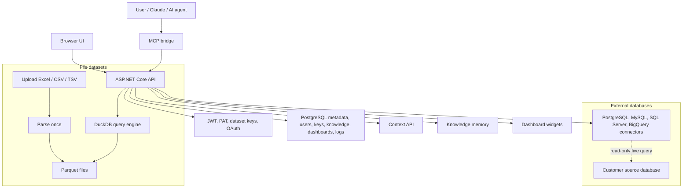

# Excel Dataset Manager

Excel Dataset Manager (EDM) is a self-hosted analytics layer for AI agents. It turns Excel/CSV files and live SQL databases into safe, queryable datasets exposed through HTTP APIs, a web UI, and an MCP bridge.

EDM is not a zero-token data reader. It is a token-controlled query layer: agents read schema, business context, SQL, and compact query results instead of loading whole spreadsheets or database dumps into a model context.

For external databases, EDM does not copy source data. It stores encrypted connection settings, schema metadata, and optional small sample rows, then runs read-only queries against the source on demand.

## Core Features

| Feature | What it does |
| --- | --- |
| File datasets | Upload Excel, CSV, or TSV files. EDM parses them once into Parquet and queries them many times through DuckDB. |
| Live external databases | Connect PostgreSQL, MySQL, SQL Server, or BigQuery. EDM stores metadata only and queries the source read-only. |
| Structured context API | `GET /api/context` returns schema, aliases, samples, and knowledge entries as compact JSON for AI agents. |
| Multi-dataset joins | Query across several uploaded file datasets by alias in one SQL statement. |
| Knowledge memory | Save metric definitions, column meanings, business rules, join hints, notes, and imported text/Markdown documents per dataset. |
| AI dashboards | Save frozen SQL widgets once, then re-run them on dashboard views without re-chatting with the agent. |
| MCP auth | Claude and other MCP clients can connect through OAuth 2.1. Users log in and approve access; no manual token copy is required. |

## Architecture



## Source Map

| Area | Path |
| --- | --- |
| API startup, DI, auth, middleware | `api/Program.cs` |
| API endpoints | `api/Endpoints/*.cs` |
| Database migrations | `api/Migrations/000N_*.sql` |
| File parsing and Parquet output | `api/Services/FileParserService.cs`, `api/Services/ParquetWriter.cs` |
| DuckDB file queries | `api/Services/DuckDbQueryService.cs` |
| External DB connectors and guards | `api/Services/Connectors/` |
| Live external queries | `api/Services/ExternalQueryService.cs` |
| Structured context | `api/Services/ContextService.cs`, `api/Services/ContextShaper.cs` |
| Knowledge memory | `api/Services/KnowledgeService.cs` |
| Dashboards | `api/Services/DashboardService.cs` |
| Secret encryption | `api/Services/SecretProtector.cs` |
| OAuth for MCP | `api/Services/OAuthService.cs`, `api/Endpoints/OAuthEndpoints.cs` |
| MCP bridge | `mcp-bridge/` |
| Browser UI | `api/wwwroot/` |
| API reference | `docs/API.md` |
| Architecture notes | `docs/ARCHITECTURE.md` |

## Security Model

- External database rows are not imported into EDM. The app stores encrypted connection settings, schema metadata, optional sample rows, and query logs.
- SQL is validated before execution. Only `SELECT` and `WITH` are accepted; write operations, DDL, file access functions, multiple statements, and dangerous dialect-specific tokens are blocked.
- PostgreSQL and MySQL connections are opened read-only where the driver supports it. You should still use read-only database accounts.
- Stored external database credentials are encrypted with AES-256-GCM and are never returned to clients.
- BigQuery queries can be capped with `maximum_bytes_billed`.
- Dashboard SQL is validated when saved and re-validated every time it runs.
- Auth is layered: browser JWTs, Personal Access Tokens for MCP, dataset-scoped API keys, and OAuth 2.1 with PKCE for MCP clients.

## Quick Start

```bash
git clone https://github.com/TolhNguyen/mcp-dataset-manager
cd mcp-dataset-manager

cp .env.example .env
cp mcp-bridge/tools.example.md mcp-bridge/tools.md
```

Edit `.env` before starting:

```bash
# Required. Use strong random values, at least 32 characters.
JWT_KEY=
EDM_ENCRYPTION_KEY=

# Required for MCP OAuth. Use https://your-domain in production.
EDM_PUBLIC_URL=http://localhost
EDM_DOMAIN=localhost
```

Start the stack:

```bash
docker compose up -d --build
```

Default local services:

| Service | URL / port | Purpose |
| --- | --- | --- |
| Web UI and API | `http://localhost:5847` | Upload, query, manage connections, knowledge, dashboards, auth |
| MCP bridge | `http://localhost:5848` | Streamable HTTP MCP bridge |
| Caddy | `http://localhost` / `https://<EDM_DOMAIN>` | Reverse proxy and HTTPS |
| PostgreSQL | `localhost:5432` | Metadata and app state |

The health endpoint is:

```bash
curl http://localhost:5847/health
```

## Connect Claude Or Another MCP Client

In remote MCP mode, point the client at:

```text
https://<your-domain>/mcp
```

Claude discovers the OAuth metadata, opens the EDM login and consent flow, and receives an access token automatically. For local scripts or stdio-style usage, create a Personal Access Token in the web UI and send it as:

```text
Authorization: Bearer edm_pat_...
```

The bridge reads tool declarations from `mcp-bridge/tools.md`. Start from `mcp-bridge/tools.example.md`, then adjust connections and tools for your deployment.

## Typical AI Workflow

```text
User: "Show revenue by city this month and remember how net revenue is defined."

Agent:
1. list_datasets
2. get_context(dataset_ids=[sales])
3. query_dataset(sales, "SELECT city, SUM(net_revenue) ... GROUP BY city")
4. save_dataset_knowledge(
     sales,
     kind="metric_definition",
     title="net_revenue",
     content="Revenue after discounts and before tax."
   )
5. create_dashboard_widget(
     dashboard_name="Sales",
     dataset_id=sales,
     title="Revenue by city",
     sql="<validated SELECT>",
     chart_type="bar"
   )
```

On the next session, `get_context` includes the saved metric definition and the dashboard can refresh from the stored SQL.

## External Database Workflow

1. Create a read-only database account in the source system.
2. In EDM, add a connection for PostgreSQL, MySQL, SQL Server, or BigQuery.
3. Test the connection. EDM warns if it can detect write-capable access.
4. Choose tables and create an external dataset.
5. EDM stores schema and optional sample rows, but not table data.
6. Agents query it with `query_dataset`; the query runs live against the source.

External datasets are queried one at a time. Cross-source joins are intentionally deferred; multi-dataset joins currently support uploaded file datasets only.

## MCP Tools

The default EDM tool set includes:

| Tool | Purpose |
| --- | --- |
| `list_datasets` | List datasets available to the user. |
| `get_context` | Fetch schema, aliases, samples, knowledge, and memory instructions. Call this before writing SQL. |
| `query_dataset` | Run read-only SQL against one file or external dataset. |
| `query_datasets` | Join several uploaded file datasets by alias. |
| `upload_dataset`, `get_dataset`, `delete_dataset` | Dataset lifecycle helpers. |
| `get_dataset_knowledge`, `save_dataset_knowledge`, `update_dataset_knowledge`, `search_knowledge` | Read and maintain business knowledge. |
| `create_dashboard_widget`, `list_dashboards`, `get_dashboard`, `update_dashboard_widget` | Build and manage live dashboards. |

See `mcp-bridge/tools.example.md` for the full tool declarations.

## Query Rules

- Use one statement per request.
- Use only `SELECT` or `WITH`.
- Do not send a trailing semicolon.
- Use normalized column names from `get_context`.
- Use dataset aliases for multi-dataset file queries, for example `sales.orders`.
- Let EDM apply row caps with `options.max_rows`; the default is 100 and the hard cap is 1000 unless configured otherwise.
- Prefer aggregation, filters, and selected columns to keep AI responses inside the token budget.

## Configuration

Important environment variables:

| Variable | Required | Purpose |
| --- | --- | --- |
| `JWT_KEY` | Yes | Signs browser JWTs. Must be at least 32 characters. |
| `EDM_ENCRYPTION_KEY` | Yes | Encrypts stored external database credentials. Must be at least 32 characters. |
| `EDM_PUBLIC_URL` | Yes for MCP OAuth | Public base URL used in OAuth metadata. Use HTTPS in production. |
| `EDM_DOMAIN` | Production | Domain served by Caddy. |
| `POSTGRES_*` | No | PostgreSQL database, user, password, and local port. |
| `QUERY_DEFAULT_LIMIT` | No | Default row limit for AI queries. |
| `QUERY_HARD_MAX_ROWS` | No | Maximum rows a query can return. |
| `QUERY_SAFE_MAX_TOKENS` | No | Soft AI token budget before confirmation or summarization. |
| `EXTERNAL_QUERY_TIMEOUT_SECONDS` | No | Timeout for live external DB queries. |
| `EXTERNAL_MAX_CONCURRENT` | No | Concurrent live queries per external connection. |
| `DASHBOARD_MAX_ROWS_PER_WIDGET` | No | Row cap for dashboard widget data. |

See `.env.example` for the complete list.

## Local Development

Run API tests:

```bash
dotnet test tests/ExcelDatasetManager.Tests/ExcelDatasetManager.Tests.csproj
```

Build the MCP bridge:

```bash
npm --prefix mcp-bridge ci
npm --prefix mcp-bridge run build
```

Validate a bridge tools file after building:

```bash
npm --prefix mcp-bridge run validate -- ./tools.md
```

## Project Status

Implemented:

- File upload, parsing, Parquet storage, and DuckDB querying.
- External database connections for PostgreSQL, MySQL, SQL Server, and BigQuery.
- Structured context API for agents.
- Dataset knowledge memory and document import.
- Multi-dataset joins for uploaded file datasets.
- Dashboard widgets with frozen SQL.
- OAuth 2.1 MCP flow and PAT support.

Deferred:

- Cross-source joins between files and external databases, or between two external databases.
- Public signed dashboard share links.
- Full live integration test harness for every external database provider.
- Semantic vector search for knowledge entries.

## Product Message

Excel Dataset Manager lets AI agents analyze spreadsheets and live databases without loading raw data into the model context. Data stays where it belongs: Parquet on your server, or your own database untouched, behind a safe read-only SQL layer, structured context, reusable business knowledge, and live dashboards.
