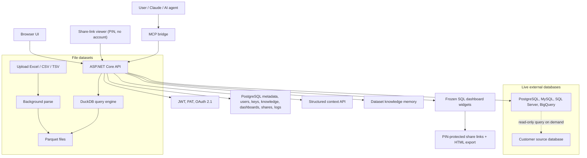

# MCP Dataset Manager

**A self-hosted MCP data layer for AI agents: file datasets, live databases, structured context, dataset memory, and AI-built dashboards.**

MCP Dataset Manager lets AI agents work with real business data without loading raw files or database dumps into the model context. It exposes datasets through a safe SQL layer, a structured context API, reusable business knowledge, and an MCP bridge that tools like Claude can call directly.

This project started as an Excel/CSV dataset manager, but it has grown into a broader MCP-native dataset system. It now supports uploaded file datasets, live external databases, cross-file joins, knowledge memory, document import, OAuth-based MCP connection, dashboard widgets generated by AI, PIN-protected dashboard share links for viewers without accounts, and encrypted static HTML dashboard exports.

> Naming note: some environment variables, token prefixes, and .NET namespaces still use legacy names such as `EDM_*`, `edm_pat_...`, and `ExcelDatasetManager.*` for compatibility. The product name used in this README is **MCP Dataset Manager**.

## Core Positioning

MCP Dataset Manager is not a zero-token data reader. It is a **token-controlled query and context layer** for AI agents.

Token usage does not disappear. It shifts from:

```text
read the entire raw file or database dump
```

to:

```text
read relevant schema + business context + SQL + compact query result
```

For live databases, the model never receives a database dump and the server does not import the source data. MCP Dataset Manager stores only encrypted connection settings, schema metadata, optional small sample rows, and query logs. Queries run live against the source through a read-only guard.

## Why This Exists

Most AI data workflows fall into one of these patterns:

1. Upload the entire spreadsheet into chat.
2. Paste raw rows into the prompt.
3. Let the model infer schema and business rules from a large context window.
4. Build one-off glue code for every internal database or partner API.
5. Re-chat every time a metric or dashboard needs fresh data.

Those patterns work for demos, but break down when:

- row count grows;
- table count grows;
- the data lives in production databases;
- the user asks many follow-up questions;
- the answer only needs 20 rows, but the model receives 200,000;
- business definitions are corrected in one session and forgotten in the next.

MCP Dataset Manager takes a different approach:

- Keep raw data outside the model context.
- Parse file datasets once, then query them many times.
- Query external databases live without copying table data.
- Give agents structured context instead of a long Markdown manifest.
- Persist business knowledge as small reusable facts.
- Enforce row caps, output token budgets, and summary modes.
- Save dashboard SQL once, then refresh it without asking the AI again.

## What It Does

| Capability | What it gives the agent | Why it matters |
| --- | --- | --- |
| File datasets | Upload `.xlsx`, `.xls`, `.xlsm`, `.csv`, or `.tsv`; parse once into Parquet; query via DuckDB. | Large spreadsheets become fast, local, repeatable SQL datasets. |
| Live database datasets | Connect PostgreSQL, MySQL, SQL Server, or BigQuery; store schema and optional 2-row samples; query source live. | AI can analyze operational databases without importing production data. |
| Structured context | `GET /api/context` returns datasets, aliases, dialect, tables, columns, samples, knowledge, and memory instructions as JSON. | Agents get the right schema/context before writing SQL. |
| Token budget controls | Query results are estimated, summarized, confirmation-gated, or blocked based on safe and hard token limits. | Large answers do not silently flood the model context. |
| Knowledge memory | Store metric definitions, column meanings, business rules, join hints, notes, and imported documents per dataset. | Business context survives across sessions and agents. |
| Multi-dataset joins | Join several uploaded file datasets by alias in one DuckDB SQL query. | Agents can answer questions across related spreadsheets. |
| AI dashboards | Agents save frozen SQL + chart config as widgets; dashboards rerun SQL on view/refresh. | A one-time chat can create a live dashboard. |
| Dashboard sharing | Owners or agents mint per-viewer share links protected by a PIN; viewers see live data without an account; each link is revocable independently. | A manager can watch a dashboard from a link, and a leaked link can be killed instantly. |
| Static HTML export | Dashboards export as a self-contained snapshot HTML file, optionally AES-GCM-encrypted behind a PIN. | Reports can travel over email/chat without exposing the server or the data. |
| Proof-of-read query gate | PAT-authenticated agents must read the query guide (`guide_token`) and the dataset schema (`schema_token`) before any query or widget SQL is accepted. | Agents cannot write SQL from stale memory or invent table names. |
| Self-correcting errors | Query failures return `available_tables`, `did_you_mean`, dialect hints, and an explicit never-fabricate instruction. | Agents fix their own SQL instead of guessing or inventing numbers. |
| OAuth MCP auth | MCP clients discover OAuth metadata, open login/consent, and receive a PAT automatically. | Users do not need to copy tokens into Claude. |
| Configurable MCP bridge | The bridge can expose this server plus partner APIs from one `tools.md`. | Agents can reconcile internal datasets with external services. |

## Product Strengths

**1. MCP-native data access**

The project is built around tools that agents actually call: `list_datasets`, `get_context`, `query_dataset`, `query_datasets`, knowledge tools, and dashboard tools. The MCP bridge is not an afterthought; it is the main agent interface.

**2. Data stays where it belongs**

Uploaded files become local Parquet on your server. External databases stay external. The system stores enough metadata for AI planning, but not full live database tables.

**3. Context is structured, filtered, and budget-aware**

The Context API replaces the old "send a giant manifest" pattern. It supports `detail=full|summary`, optional `tables=` filtering, token estimation, automatic downgrade to summary, and `memory_instructions` that tell the agent when to save new knowledge.

**4. Knowledge grows with use**

When a user says "net revenue excludes VAT" or corrects a column meaning, the agent can save that as a dataset knowledge entry. Future agents see it through `get_context` or `search_knowledge`. This is cheaper than embeddings today: PostgreSQL `pg_trgm` + `unaccent`, with a clean path to vector search later.

**5. SQL is treated as a security boundary**

All AI SQL goes through read-only validation. File datasets use DuckDB over Parquet. External datasets use provider-aware guards for PostgreSQL, MySQL, SQL Server, and BigQuery, plus row caps, timeouts, concurrency limits, and read-only sessions where supported.

**6. Dashboards are not model-dependent after creation**

The AI creates a widget once. After that, the browser calls a data endpoint. The widget SQL is frozen, re-validated every execution, row-capped, and cached by refresh interval. Fresh data does not require another chat.

**7. Dashboards can leave the building safely**

A dashboard can be handed to a manager as a PIN-protected live link (revocable per recipient, auditable, no account needed) or as a frozen snapshot HTML file whose embedded data is AES-GCM-encrypted when a PIN is set. In both paths the viewer never sees SQL, schema, or credentials — only titles, charts, and result values.

## Architecture



### Source Map

| Area | Path |
| --- | --- |
| API startup, DI, auth, middleware | `api/Program.cs` |
| Endpoint groups | `api/Endpoints/*.cs` |
| Numbered migrations | `api/Migrations/000N_*.sql` |
| File parsing | `api/Services/FileParserService.cs` |
| Header normalization and column stats | `api/Services/HeaderNormalizer.cs`, `api/Services/ColumnStats.cs` |
| Parquet conversion | `api/Services/ParquetWriter.cs` |
| DuckDB file queries and file-dataset joins | `api/Services/DuckDbQueryService.cs` |
| External DB connectors and SQL guard | `api/Services/Connectors/` |
| Live external query path | `api/Services/ExternalQueryService.cs` |
| Structured context | `api/Services/ContextService.cs`, `api/Services/ContextShaper.cs` |
| Knowledge memory and document import | `api/Services/KnowledgeService.cs`, `api/Services/DocumentImporter.cs` |
| Dashboard widgets | `api/Services/DashboardService.cs`, `api/Services/DashboardGuard.cs` |
| Query guide + proof-of-read gate | `api/Services/QueryGuideService.cs`, `api/Services/SchemaTokenService.cs`, `api/Services/SchemaTokenGate.cs`, `api/Services/DialectNotes.cs` |
| Self-correcting query errors | `api/Services/Connectors/ExternalErrorEnricher.cs`, pre-flight rules in `api/Services/Connectors/ExternalQueryGuard.cs` |
| Dashboard share links | `api/Services/DashboardShareService.cs`, `api/Services/ShareCrypto.cs`, `api/Services/ShareSessionProtector.cs`, `api/Endpoints/ShareEndpoints.cs`, `api/Endpoints/ShareAdminEndpoints.cs` |
| Static HTML export | `api/Services/DashboardExportService.cs`, `api/Endpoints/ExportEndpoints.cs` |
| Token budgeting | `api/Services/AiTokenBudgetService.cs` |
| Secret encryption | `api/Services/SecretProtector.cs` |
| OAuth 2.1 for MCP | `api/Services/OAuthService.cs`, `api/Endpoints/OAuthEndpoints.cs` |
| MCP bridge | `mcp-bridge/` |
| Web UI | `api/wwwroot/` |
| API reference | `docs/API.md` |
| Architecture notes | `docs/ARCHITECTURE.md` |

## Dataset Types

### File Datasets

File datasets are uploaded into MCP Dataset Manager.

Pipeline:

```text
Excel / CSV / TSV
-> background parser
-> normalized headers and aliases
-> type inference and column stats
-> Parquet files
-> DuckDB views
-> compact JSON query results
```

Strengths:

- Good for spreadsheets, exports, recurring CSV reports, and multi-sheet workbooks.
- Data is stored locally as Parquet.
- Multi-dataset joins are supported across file datasets by alias, for example `sales.orders`.
- Column errors can return suggestions so agents can self-correct.

### Live External Database Datasets

External database datasets are created from PostgreSQL, MySQL, SQL Server, or BigQuery connections.

Stored by MCP Dataset Manager:

- encrypted connection config;
- table and column metadata;
- optional 2 sample rows per table;
- query logs with SQL and execution metadata.

Not stored:

- full source table rows;
- query result rows;
- database passwords or service-account JSON in responses.

Live database datasets are queried one at a time with `query_dataset`. Tables inside the same source database can be joined by the source SQL dialect. Cross-source joins are intentionally deferred.

## Token Efficiency Model

A direct upload workflow behaves roughly like this:

```text
direct upload token cost
= raw_file_tokens x number_of_questions_or_context_reloads
```

MCP Dataset Manager behaves more like this:

```text
per-question token cost
= relevant_schema_tokens
 + business_question_tokens
 + generated_sql_tokens
 + query_result_tokens
 + retained_chat_history_tokens
```

The important claim is precise:

> MCP Dataset Manager makes token usage depend on the data needed for the answer, not on the full size of the raw dataset.

It does not make token usage constant. If you ask for too many columns, too many rows, too many tables, or keep all previous query results in chat history, tokens still grow. The system is designed to expose and control those costs.

### Scenario A: Row Count Grows, Result Stays Small

This is the strongest case. If a file grows from 1,000 rows to 1,000,000 rows but the user asks for an aggregate or top-N result, the model still only needs schema, SQL, and the limited result.

| Dataset size | Raw upload pressure | MCP Dataset Manager query pressure | With summary mode |
| ---: | ---: | ---: | ---: |
| 1K rows | 10 | 8 | 6 |
| 10K rows | 45 | 9 | 6 |
| 30K rows | 75 | 10 | 7 |
| 100K rows | 100 | 12 | 8 |
| 1M rows | 100 | 15 | 9 |

Good claim:

> When row count grows but the answer is an aggregate or limited result, MCP Dataset Manager prevents token usage from growing with the full raw file.

Bad claim:

> Token usage is fixed no matter how data grows.

### Scenario B: Many Tables, Small Data Per Table

This case shifts the risk from row tokens to schema tokens. A dataset with 300 small tables can still be expensive if the agent receives every table schema every time.

| Table count | Raw upload pressure | Full context pressure | Relevant schema only |
| ---: | ---: | ---: | ---: |
| 5 tables | 15 | 10 | 8 |
| 20 tables | 45 | 25 | 10 |
| 50 tables | 75 | 45 | 12 |
| 100 tables | 95 | 70 | 15 |
| 300 tables | 100 | 95 | 22 |

Optimization:

```text
user question
-> identify likely dataset and table names
-> call get_context with tables=
-> generate SQL from relevant schema only
-> execute query
-> return compact result or summary
```

### Scenario C: Long Chat Sessions

Even with controlled query results, long sessions can become expensive if every previous result stays in chat history.

| Questions in session | Raw upload in context | Keeping full query results | Keeping summaries |
| ---: | ---: | ---: | ---: |
| 1 | 80 | 10 | 8 |
| 3 | 90 | 25 | 12 |
| 5 | 95 | 40 | 16 |
| 10 | 100 | 70 | 25 |
| 20 | 100 | 100 | 40 |

Optimization:

- Keep answers and business facts.
- Save durable facts into knowledge memory.
- Summarize old result sets.
- Re-query when fresh rows are needed instead of keeping old raw rows in chat.

## Token-Control Policies

| Risk | Control in MCP Dataset Manager |
| --- | --- |
| Raw file is too large | Store file data outside model context and query Parquet through DuckDB. |
| Source database is production-sized | Store metadata only and query source live with row caps/timeouts. |
| Too many tables | Use `get_context?tables=...` and automatic summary downgrade. |
| Query returns too many rows | Enforce `max_rows`, `Query:HardMaxRows`, summary mode, and confirmation flow. |
| Result has too many columns | Prefer explicit column selection; tools suggest avoiding `SELECT *`. |
| Long chat history grows | Save facts to knowledge memory and summarize old results. |
| AI writes unsafe SQL | Validate `SELECT`/`WITH` only; block DML, DDL, file access, provider-specific dangerous tokens. |
| AI writes SQL from stale memory | Proof-of-read gate: queries require a fresh `schema_token` from `get_context`. |
| AI invents numbers after a failure | Every error envelope carries a never-fabricate instruction plus self-correction hints. |
| Dashboard refresh hammers DB | Enforce min refresh, TTL cache, row cap, timeout, and concurrency limit. |
| Share viewers hammer DB | Viewer data reuses the widget TTL cache, row caps, and the query rate limiter; PIN attempts have their own stricter limiter. |

### Response Modes

| Mode | Purpose |
| --- | --- |
| `compact_table` | Normal capped query result: columns + rows + row count. |
| `summary` | Large or broad results: preview rows, column list, and suggestions. |
| confirmation required | Result is above safe token budget but below hard budget. |
| hard blocked | Result exceeds hard token budget and cannot be returned raw to AI chat. |
| dashboard data | Bypasses AI token budget because it goes to the browser, but still keeps row cap and timeout. Share-link viewers use this same path. |

## Security Model

MCP Dataset Manager handles user files, database credentials, live production databases, and AI-generated SQL. The security model is intentionally layered.

### SQL Safety

- Only `SELECT` and `WITH` statements are accepted.
- Multiple statements are rejected.
- File-access functions such as `read_parquet`, `parquet_scan`, `read_text`, `read_blob`, and `glob` are blocked for AI queries.
- External database SQL is validated with provider-aware blocklists.
- Row caps are applied server-side.
- Query timeouts are applied.
- Query logs record submitted SQL, executed SQL, elapsed time, row count, estimated tokens, and error codes.

### External Database Safety

- Connection configs are encrypted with AES-256-GCM.
- API responses never return raw passwords or service-account JSON.
- PostgreSQL and MySQL sessions are opened read-only where supported.
- SQL Server relies on the guard plus the strongly recommended read-only account because session-level read-only is not available in the same way.
- BigQuery supports `maximum_bytes_billed`.
- Per-connection concurrency is limited.
- Sample rows can be disabled per external dataset.

### AI Behavior Guardrails (Proof-of-Read Gate)

PAT-authenticated agents cannot query from memory. The server enforces a stateless two-step proof-of-read chain:

- `get_query_guide` returns a usage guide plus a `guide_token` derived from the guide content (editing the guide invalidates old tokens, forcing agents to re-read).
- `get_context` requires that `guide_token` and returns a `schema_token` per dataset — a fingerprint of the stored table/column schema.
- `query_dataset`, `query_datasets`, and widget SQL writes require the current `schema_token`. A missing token returns `CONTEXT_REQUIRED`; a stale token (schema changed) returns `SCHEMA_CHANGED`.
- Browser JWT sessions are exempt; the gate targets the MCP path where agents write SQL.
- Every query error envelope carries an `assistant_instruction` telling the agent to report failures verbatim and never fabricate data, and failed external queries are enriched with `available_tables`, `suggested_columns`, `did_you_mean`, and dialect hints computed from stored metadata — the source database is never re-queried to build error hints.
- Pre-flight SQL checks catch common agent mistakes before they reach the customer database: incomplete `WITH` blocks, unsupported `@parameters`, and MSSQL `[schema.table]` bracket fusion.

### Dashboard Safety

- Widget SQL is frozen when saved.
- Browser widget refreshes never send SQL.
- SQL is validated when saved and re-validated every execution.
- Save-time validation also trial-runs the query with a small limit to catch bad columns/tables early.
- Widget data is row-capped and cached by refresh interval.
- Widget creation and SQL updates through a PAT require the dataset's `schema_token` (same proof-of-read gate as queries).

### Dashboard Share Links

Share links let a viewer without an account watch one dashboard live, protected by a PIN:

- Share tokens are 160-bit random values; the database stores only their SHA-256 hash. PINs are stored as PBKDF2-SHA256 hashes with per-share salts.
- The viewer surface is exactly three anonymous endpoints (PIN exchange, dashboard metadata, widget data). None accept SQL, and no viewer response contains SQL.
- Every invalid token — unknown, expired, or revoked — returns an identical bare 404, so the endpoints cannot be used to probe which links exist.
- Wrong PINs are counted per share: every 5th consecutive failure locks the share with exponential backoff (15 min, 30 min, 60 min, ...), on top of a per-IP rate limit on PIN attempts.
- A correct PIN sets a Data-Protection-signed, HttpOnly session cookie (12 h, scoped to `/api/share`). Every viewer call still re-resolves the share from the database, so revoking a link cuts off existing sessions immediately.
- Each dashboard allows up to 10 live shares (one per recipient), each with its own PIN, expiry (default 30 days, max 90), view counter, and independent revocation.
- The link and PIN are returned exactly once at creation time and are never retrievable again.

### Static HTML Export

- Exports run each widget's frozen SQL once and embed the results into a single self-contained HTML file (Chart.js inlined, snapshot timestamp banner).
- With a PIN, the embedded data is encrypted with AES-256-GCM (key derived via PBKDF2, 150k iterations) and decrypted in the browser via WebCrypto — a wrong PIN fails authentication and reveals nothing. Without a PIN the file is plain, equivalent to mailing a spreadsheet.
- The file is delivered through a one-time download URL that expires after 10 minutes.

### Authorization

- Browser sessions use JWT.
- MCP clients use Personal Access Tokens (`edm_pat_...`); dataset-scoped API keys have been removed.
- A per-dataset `ai_can_write_knowledge` toggle (default on) controls whether AI can create, update, or archive knowledge entries for that dataset; reads are unaffected.
- Share management (create/list/revoke) works over both JWT and PAT, so an agent can mint or kill share links on request; tokens and PINs are never listable after creation.
- MCP OAuth 2.1 uses PKCE S256 and mints a revocable PAT automatically.

## MCP Tool Workflow

Recommended agent flow:

```text
1. get_query_guide                       -> read the guide, keep guide_token
2. list_datasets
3. get_context(dataset_ids=[...], guide_token, detail="full" or "summary")
                                         -> schema, dialect_notes, schema_token per dataset
4. query_dataset or query_datasets       -> pass schema_token with the SQL
5. save_dataset_knowledge when the user gives durable business context
6. create_dashboard_widget when the user wants to monitor a metric
7. share_dashboard / export_dashboard when the user wants to send it to someone
```

Steps 1 and 3-4 are enforced, not just recommended: without the tokens the server rejects the call (`GUIDE_REQUIRED`, `CONTEXT_REQUIRED`, or `SCHEMA_CHANGED`), and the error tells the agent exactly which call to make next.

Example:

```text
User: "Show revenue by city this month. Net revenue excludes VAT and discounts should be subtracted."

Agent:
1. get_query_guide()                      -> guide + guide_token
2. get_context(dataset_ids=[sales], tables=orders, detail=full, guide_token)
                                          -> schema + dialect_notes + schema_token
3. query_dataset(sales, "
     SELECT city, SUM(gross_revenue - discount - vat) AS net_revenue
     FROM orders
     WHERE order_month = '2026-07'
     GROUP BY city
     ORDER BY net_revenue DESC
   ", schema_token)
4. save_dataset_knowledge(
     kind="metric_definition",
     title="net_revenue",
     content="Net revenue is gross revenue minus discount and VAT."
   )
5. create_dashboard_widget(
     dashboard_name="Sales",
     title="Net revenue by city",
     sql="<validated SELECT>",
     chart_type="bar",
     schema_token
   )
6. share_dashboard(dashboard_id, expires_in_days=30)
                                          -> share_url + PIN, shown once
   "Here is the link for your manager — send the PIN separately."
```

Next session, the saved metric definition appears in context and the dashboard refreshes from frozen SQL without another chat.

## Default MCP Tools

| Tool | Purpose |
| --- | --- |
| `get_query_guide` | Fetch the usage guide and the `guide_token` required by `get_context`. Call first in every session. |
| `list_datasets` | List datasets available to the user. |
| `get_context` | Fetch structured schema, aliases, dialect, `dialect_notes`, samples, knowledge, memory instructions, and the `schema_token` required by query tools. |
| `query_dataset` | Run one read-only SQL query against a file or live external dataset (requires `schema_token`). |
| `query_datasets` | Join several uploaded file datasets by alias in one DuckDB query (requires `schema_tokens` for every dataset). |
| `upload_dataset`, `get_dataset`, `delete_dataset` | Dataset lifecycle. |
| `get_dataset_knowledge`, `save_dataset_knowledge`, `update_dataset_knowledge`, `search_knowledge` | Read and maintain dataset memory (writes honor the per-dataset AI write toggle). |
| `create_dashboard_widget`, `list_dashboards`, `get_dashboard`, `update_dashboard_widget` | Build and manage live dashboards (SQL writes require `schema_token`). |
| `share_dashboard`, `list_dashboard_shares`, `revoke_dashboard_share` | Mint, inspect, and revoke PIN-protected viewer links for a dashboard. |
| `export_dashboard` | Produce a self-contained snapshot HTML file (optionally PIN-encrypted) via a one-time download URL. |

The bridge can also expose partner APIs from the same `tools.md`, so an agent can compare internal datasets with outside systems in one conversation.

## Query Rules For Agents

- Call `get_query_guide` once per session and keep the `guide_token`.
- Call `get_context` (with the `guide_token`) before writing SQL, and pass the returned `schema_token` with every query.
- Re-read context when a query returns `SCHEMA_CHANGED` — the schema was updated and the old token is void.
- Use normalized column names from context, not original spreadsheet headers.
- Use the dataset dialect from context (`duckdb`, `postgresql`, `mysql`, `mssql`, or `bigquery`) and obey its `dialect_notes` — for example `[dbo].[table]` not `[dbo.table]` on MSSQL, a final `SELECT` after every `WITH` block, and no `@parameters` anywhere (inline literal values).
- Use one SQL statement per request.
- Use only `SELECT` or `WITH`.
- Do not send a trailing semicolon.
- Use dataset aliases for file multi-dataset joins, for example `sales.orders`.
- Prefer explicit columns over `SELECT *`.
- Prefer aggregation and filters before returning rows.
- Set `options.max_rows` intentionally. The default is 100 and the hard cap is 1000 unless configured otherwise.
- On failure, fix the SQL using `error.details` (`available_tables`, `did_you_mean`, hints) and retry at most twice; then report the exact error. Never estimate, interpolate, or fabricate data values.

## Quick Start

```bash
git clone https://github.com/TolhNguyen/mcp-dataset-manager
cd mcp-dataset-manager

cp .env.example .env
cp mcp-bridge/tools.example.md mcp-bridge/tools.md
```

Edit `.env`:

```bash
# Required. Use strong random values, at least 32 characters.
JWT_KEY=
EDM_ENCRYPTION_KEY=

# Required for MCP OAuth. Use https://your-domain in production.
EDM_PUBLIC_URL=http://localhost
EDM_DOMAIN=localhost
```

Start:

```bash
docker compose up -d --build
```

Default services:

| Service | Default | Purpose |
| --- | --- | --- |
| API and web UI | `http://localhost:5847` | Datasets, connections, knowledge, dashboards, auth |
| MCP bridge | `http://localhost:5848` | Streamable HTTP MCP endpoint |
| Caddy | `http://localhost` / `https://<EDM_DOMAIN>` | Reverse proxy and HTTPS |
| PostgreSQL | `localhost:5432` | Metadata and app state |

Health check:

```bash
curl http://localhost:5847/health
```

## Connect Claude Or Another MCP Client

For remote MCP mode, point the client at:

```text
https://<your-domain>/mcp
```

The client discovers OAuth metadata, opens the login/consent page, and receives a bearer token automatically.

For scripts or stdio-style usage, create a Personal Access Token in the web UI and send:

```text
Authorization: Bearer edm_pat_...
```

The bridge reads tool declarations from:

```text
mcp-bridge/tools.md
```

Start from `mcp-bridge/tools.example.md`, then adjust the connections and tools for your deployment.

## Configuration

Important environment variables:

| Variable | Required | Purpose |
| --- | --- | --- |
| `JWT_KEY` | Yes | Signs browser JWTs. Must be at least 32 characters. |
| `EDM_ENCRYPTION_KEY` | Yes | Encrypts stored external database credentials. Must be at least 32 characters. |
| `EDM_PUBLIC_URL` | Yes for MCP OAuth | Public base URL used in OAuth metadata. Use HTTPS in production. |
| `EDM_DOMAIN` | Production | Domain served by Caddy. |
| `POSTGRES_*` | No | PostgreSQL database, user, password, and local port. |
| `QUERY_DEFAULT_LIMIT` | No | Default query row limit. |
| `QUERY_HARD_MAX_ROWS` | No | Maximum rows a query can return. |
| `QUERY_SAFE_MAX_TOKENS` | No | Soft AI token budget before confirmation or summarization. |
| `QUERY_HARD_MAX_TOKENS` | No | Hard AI token budget. |
| `EXTERNAL_QUERY_TIMEOUT_SECONDS` | No | Timeout for live external database queries. |
| `EXTERNAL_MAX_CONCURRENT` | No | Concurrent live queries per external connection. |
| `DASHBOARD_MAX_ROWS_PER_WIDGET` | No | Row cap for dashboard widget data. |
| `Proxy__TrustForwardedHeaders` | Behind a proxy | Trust `X-Forwarded-*` from the reverse proxy. Required for the share-viewer cookie to carry the `Secure` flag when TLS terminates at the proxy (set by default in `docker-compose.yml`; set it yourself behind IIS/ARR or another proxy). |

See `.env.example` for the complete list.

## Local Development

Run API tests:

```bash
dotnet test tests/ExcelDatasetManager.Tests/ExcelDatasetManager.Tests.csproj
```

Build the MCP bridge:

```bash
npm --prefix mcp-bridge ci
npm --prefix mcp-bridge run build
```

Validate a bridge tools file after building:

```bash
npm --prefix mcp-bridge run validate -- ./tools.md
```

## Project Status

Implemented:

- File upload, background parsing, Parquet storage, and DuckDB querying.
- PostgreSQL, MySQL, SQL Server, and BigQuery live query connectors.
- Dialect-aware external SQL guard.
- Structured Context API with token-aware full/summary mode.
- Knowledge memory with revisions, guardrails, document import, and accent-insensitive search.
- Multi-dataset joins across uploaded file datasets.
- Dashboard widgets with frozen SQL, double validation, TTL cache, and browser refresh.
- Proof-of-read query gate: query guide with `guide_token`, per-dataset `schema_token`, dialect notes, pre-flight SQL checks, enriched self-correcting errors, and anti-fabrication instructions on every error envelope.
- PIN-protected dashboard share links: hashed tokens, PBKDF2 PINs, lockout backoff, revocation that beats live sessions, per-link view audit.
- Static HTML dashboard export with optional AES-GCM PIN encryption and one-time download URLs.
- Per-dataset AI knowledge-write toggle (replaced dataset-scoped API keys).
- OAuth 2.1 MCP flow that mints revocable PATs.
- Configurable MCP bridge with examples for partner APIs.

Deferred by design:

- Cross-source joins between files and external databases, or between separate external databases.
- Share bundles (one link opening a catalog of several dashboards) and viewer accounts/roles.
- Embedding shared dashboards in other sites (iframe) and per-view owner notifications.
- Full live integration harness for every external database provider.
- Semantic vector search for knowledge entries.
- Measured tokenizer benchmark suite to replace the README's relative token-pressure examples.

## Best-Fit Use Cases

| Use case | Fit |
| --- | --- |
| Large spreadsheet, small analytical answer | Excellent |
| Repeated aggregate questions over files | Excellent |
| Live read-only analytics over operational DBs | Strong |
| AI-maintained metric definitions and rules | Strong |
| Dashboard generated once and refreshed later | Strong |
| Sharing a live dashboard with a manager via link + PIN | Strong |
| Emailing a frozen, optionally encrypted report file | Strong |
| Many-table dataset with relevant schema filtering | Good |
| Full raw data export into the model | Not a token-saving use case |
| Fully public dashboards (no PIN at all) | Deferred — every share link requires a PIN |

## Product Message

MCP Dataset Manager gives AI agents a safe, token-controlled way to work with datasets. Files become local Parquet queried by DuckDB. External databases stay live and are queried read-only. Agents must prove they read the guide and the schema before any query is accepted, and every failure teaches them how to fix their SQL instead of inventing numbers. Agents receive structured context, reusable business knowledge, and compact results instead of raw data dumps. Dashboards can be created by AI once, refreshed later without another chat, shared with non-users through revocable PIN-protected links, or exported as encrypted snapshot files.
